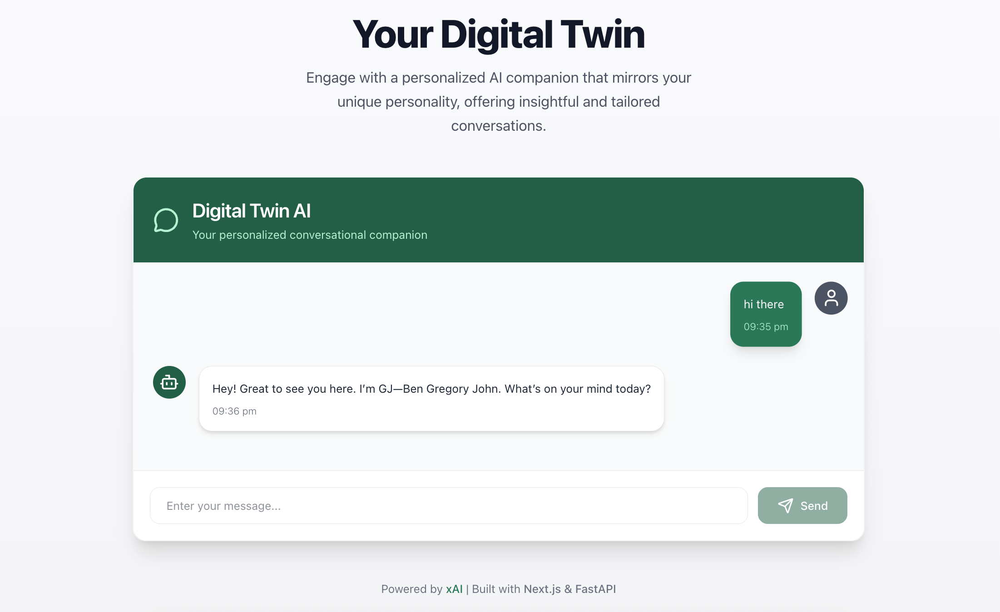

# Digital Twin

- **Digital Twin** is a personalized AI chatbot that mirrors your personality, providing a conversational experience tailored to your unique traits and preferences. 

- Built with a modern tech stack, it features a sleek, professional frontend with a white and green theme and a robust backend powered by FastAPI and OpenAI's API. 

- This project showcases end-to-end development, from API-driven backend logic to an interactive, user-friendly interface.

---
## Overview



---

## Features

- **Personalized AI**: Responds with a personality defined in `me.txt`, powered by OpenAI's GPT-4o-mini.

- **Modern UI**: A professional, responsive frontend with a white and green theme, built using Next.js and TailwindCSS.

- **Session Management**: Maintains conversation context with session IDs for a seamless user experience.

- **Real-Time Interaction**: Smooth, asynchronous chat with loading states and timestamped messages.

- **CORS Support**: Configurable Cross-Origin Resource Sharing for secure frontend-backend communication.

- **Error Handling**: Robust error management for reliable API responses.

---

## Architecture
The Digital Twin follows a modular, scalable architecture:

```
User Browser → Next.js Frontend → FastAPI Backend → OpenAI API
                     ↑                    ↓
                     └──── JSON Memory Files ←─┘
```

- **User Browser**: Interacts with the responsive Next.js frontend.

- **Next.js Frontend**: Handles real-time UI updates and sends user messages to the backend.

- **FastAPI Backend**: Processes requests, integrates with OpenAI’s API, and manages session-based conversation history.

- **OpenAI API**: Powers personalized AI responses using the GPT-4o-mini model.

- **JSON Memory Files**: Store conversation history per session, ensuring persistence across server restarts.

---

## Key Components

1. **Frontend (Next.js with App Router)**:
   - `app/page.tsx`: Main page leveraging Server Components for optimized rendering.
   - `components/twin.tsx`: Client-side chat component with real-time state management and smooth UI transitions.
   - Features hover effects, animations, and a dark olive green theme for a professional look.

2. **Backend (FastAPI)**:
   - RESTful API with endpoints for chat, health checks, and welcome messages.
   - Integrates with OpenAI’s API for AI-driven responses.
   - Manages sessions via UUID and persists conversations in JSON files.

3. **Memory System**:
   - Stores conversation history in JSON files, keyed by session ID.
   - Ensures persistence across server restarts for consistent user experiences.
   - Limits memory usage by capping conversation history per session (configurable).

---


## Installation

1. **Clone the Repository**
   ```bash
   git clone https://github.com/BenGJ10/Digital-Twin.git
   cd Digital-Twin
   ```

2. **Backend Setup**
   - Navigate to the backend directory (assuming it's the root or a subdirectory):
     ```bash
     cd backend
     ```
   - Create a virtual environment and activate it:
     ```bash
     python -m venv venv
     source venv/bin/activate  # On Windows: venv\Scripts\activate
     ```
   - Install dependencies:
     ```bash
     pip install -r requirements.txt
     ```
   - Create a `.env` file in the backend directory and add your OpenAI API key:
     ```bash
     OPENAI_API_KEY=your-openai-api-key
     CORS_ORIGINS=http://localhost:3000
     ```
   - Update the `me.txt` file with your personality traits.

3. **Frontend Setup**
   - Navigate to the frontend directory (assuming it's in a `frontend` folder or root):
     ```bash
     cd frontend
     ```
   - Install dependencies:
     ```bash
     npm install
     ```

---


## Running the Application

1. **Start the Backend**
   - From the backend directory:
     ```bash
     uvicorn server:app --host 0.0.0.0 --port 8000
     ```
   - The API will be available at `http://localhost:8000`.

2. **Start the Frontend**
   - From the frontend directory:
     ```bash
     npm run dev
     ```
   - The frontend will be available at `http://localhost:3000`.

3. **Access the Application**
   - Open your browser and navigate to `http://localhost:3000` to interact with the chatbot.

---

## API Endpoints

- **GET /**: Returns a welcome message for the API.
  - Response: `{"message": "AI Digital Twin API"}`

- **GET /health**: Checks the API's health status.
  - Response: `{"status": "healthy"}`

- **POST /chat**: Sends a user message and receives the AI's response.
  - Request Body: `{"message": "Your message", "session_id": "optional-session-id"}`
  - Response: `{"response": "AI response", "session_id": "generated-or-provided-session-id"}`

---

## License
This project is licensed under the MIT License. See the [LICENSE](LICENSE) file for details.

---