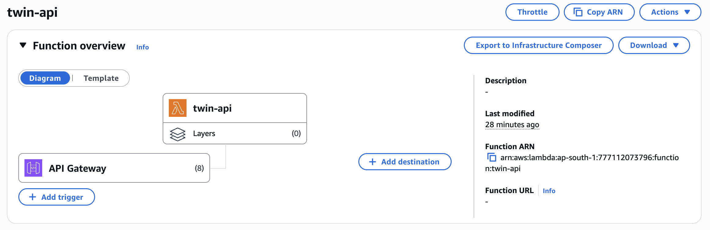

# Digital Twin

- **Digital Twin** is a personalized AI chatbot that mirrors your personality, providing a conversational experience tailored to your unique traits and preferences. 

- It combines OpenAI’s GPT models, FastAPI, Next.js, and AWS infrastructure (Lambda, API Gateway, S3, CloudFront, and Route53) for a fully serverless deployment.

- This project showcases end-to-end development, from API-driven backend logic to an interactive, user-friendly interface.

---
## Overview


* **Frontend:** Modern Next.js + TailwindCSS (white-green theme)

* **Backend:** FastAPI running on AWS Lambda

* **AI Engine:** OpenAI GPT models (via OpenAI API)

* **Infrastructure:** Terraform-managed AWS stack

* **Deployment:** Fully automated with S3, CloudFront, and API Gateway

---

## Features

* **Personalized AI:** Custom personality loaded from `me.txt`

* **Serverless Infrastructure:** Powered by AWS Lambda + API Gateway

* **Persistent Memory:** Session-based conversation storage in S3

* **Real-Time Chat:** Async interaction with timestamps and typing states

* **Secure API Access:** Configurable CORS + API throttling

* **Scalable Deployment:** Frontend hosted on CloudFront, backend on Lambda

* **Optional Custom Domain:** HTTPS via ACM & Route53 DNS integration

---

## Architecture
The Digital Twin follows a modular, scalable architecture:



```
User → CloudFront → S3 (Frontend)
         ↓
      API Gateway → Lambda (FastAPI)
                        ↓
                    OpenAI API
                        ↓
                       S3
```

## Infrastructure Breakdown

| Service                    | Purpose                           | Notes                                |
| -------------------------- | --------------------------------- | ------------------------------------ |
| **AWS Lambda**             | Hosts the FastAPI backend         | Packaged via `lambda-deployment.zip` |
| **API Gateway (HTTP API)** | Routes requests to Lambda         | Includes throttling limits           |
| **S3 (Frontend)**          | Static hosting for Next.js build  | Public-read with website hosting     |
| **S3 (Memory)**            | Stores chat sessions              | Private bucket                       |
| **CloudFront**             | CDN for global access             | HTTPS + caching                      |
| **Route53 + ACM**          | (Optional) Custom domain with SSL | For production setup                 |
| **Terraform**              | Infrastructure as Code            | Manages the entire AWS stack         |

---

## API Throttling (Rate Limits)

To prevent abuse and control costs, **API Gateway throttling** is configured in Terraform:

```hcl
api_throttle_burst_limit = 10
api_throttle_rate_limit  = 5
```

These define:

* **Burst Limit:** Number of requests that can be served instantly (spike handling)
* **Rate Limit:** Average requests per second allowed

You can change these values in:

```
terraform/variables.tf
```

Or via the AWS Console:

1. Navigate to **API Gateway → Your API → Stages → Default Stage**
2. Under **Route Settings**, set throttling values for burst and rate limits.

---

## OpenAI Integration

The backend uses OpenAI models to generate AI responses.

**In Terraform:**

```hcl
variable "openai_api_key" {
  description = "OpenAI API key for accessing GPT models"
  type        = string
}
```

**In the Lambda environment:**

```bash
OPENAI_API_KEY = var.openai_api_key
MODEL_NAME     = var.openai_model_id
```

You can set your API key in one of these ways:

* Temporarily during `terraform apply` when prompted.
* Or permanently by exporting:

  ```bash
  export TF_VAR_openai_api_key="sk-xxxx"
  ```

---

## Installation

1. **Clone the Repository**
   ```bash
   git clone https://github.com/BenGJ10/Digital-Twin.git
   cd Digital-Twin
   ```

2. **Backend Setup**
   - Navigate to the backend directory (assuming it's the root or a subdirectory):
     ```bash
     cd backend
     ```
   - Create a virtual environment and activate it:
     ```bash
     python -m venv venv
     source venv/bin/activate  # On Windows: venv\Scripts\activate
     ```
   - Install dependencies:
     ```bash
     pip install -r requirements.txt
     ```
   - Create a `.env` file in the backend directory and add your OpenAI API key:
     ```bash
     OPENAI_API_KEY=your-openai-api-key
     CORS_ORIGINS=http://localhost:3000
     ```
   - Update the `me.txt` file with your personality traits.

3. **Frontend Setup**
   - Navigate to the frontend directory (assuming it's in a `frontend` folder or root):
     ```bash
     cd frontend
     ```
   - Install dependencies:
     ```bash
     npm install
     ```

---

## Deployment Workflow

### 1. Build & Deploy Script

Deployment is automated using `deploy.sh`:

```bash
./scripts/deploy.sh dev twin
```

It performs:

1. Builds the Lambda backend package
2. Initializes and applies Terraform
3. Deploys the frontend to S3
4. Syncs with CloudFront CDN
5. Outputs your public URLs

---

### 2. Terraform Variables (example)

```hcl
project_name             = "twin"
environment              = "dev"
openai_model_id          = "gpt-4o-mini"
lambda_timeout           = 60
api_throttle_burst_limit = 10
api_throttle_rate_limit  = 5
use_custom_domain        = false
root_domain              = ""
```

To use a custom domain (e.g., `chat.yourdomain.com`):

1. Set `use_custom_domain = true`
2. Add your `root_domain`
3. Terraform will automatically create ACM + Route53 records.

---

## Running the Application

1. **Start the Backend**
   - From the backend directory:
     ```bash
     uvicorn server:app --host 0.0.0.0 --port 8000
     ```
   - The API will be available at `http://localhost:8000`.

2. **Start the Frontend**
   - From the frontend directory:
     ```bash
     npm run dev
     ```
   - The frontend will be available at `http://localhost:3000`.

3. **Access the Application**
   - Open your browser and navigate to `http://localhost:3000` to interact with the chatbot.

---

## API Endpoints

- **GET /**: Returns a welcome message for the API.
  - Response: `{"message": "AI Digital Twin API"}`

- **GET /health**: Checks the API's health status.
  - Response: `{"status": "healthy"}`

- **POST /chat**: Sends a user message and receives the AI's response.
  - Request Body: `{"message": "Your message", "session_id": "optional-session-id"}`
  - Response: `{"response": "AI response", "session_id": "generated-or-provided-session-id"}`

---

## AWS Console Tips

| Task                     | Service       | Console Path                            |
| ------------------------ | ------------- | --------------------------------------- |
| View Lambda logs         | CloudWatch    | Logs → Log groups → Lambda              |
| Adjust API limits        | API Gateway   | Stages → Default stage → Route Settings |
| Invalidate cache         | CloudFront    | Distributions → Create Invalidation     |
| Upload frontend manually | S3            | Your bucket → Upload files              |
| Setup custom domain      | Route53 + ACM | Request certificate → Add DNS records   |

---

## License
This project is licensed under the MIT License. See the [LICENSE](LICENSE) file for details.

---